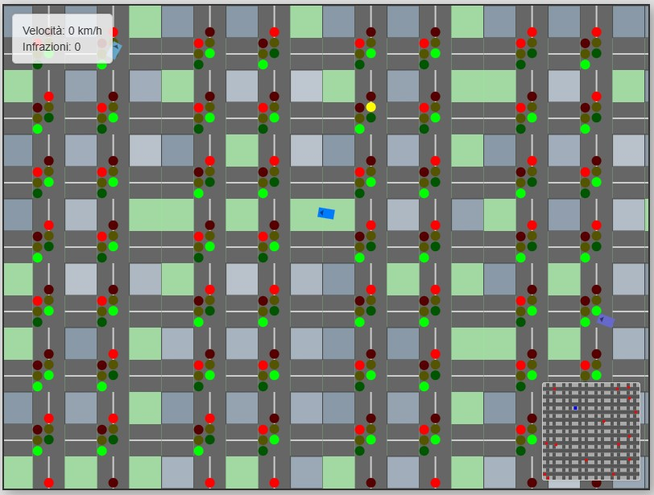

# City Driver 2D

Un semplice simulatore di guida 2D top-down creato con HTML, CSS e JavaScript Canvas.

## Descrizione

City Driver 2D è un gioco in cui controlli un'auto in una città generata proceduralmente con traffico AI e semafori funzionanti. L'obiettivo è guidare rispettando le regole della strada, evitando collisioni e infrazioni.

## Come Giocare

1.  **Apri il file:** Apri il file `index.html` in un browser web moderno.
2.  **Controlli:**
    *   **Accelerare:** `W` o `Freccia Su`
    *   **Frenare/Retromarcia:** `S` o `Freccia Giù`
    *   **Sterzare a Sinistra:** `A` o `Freccia Sinistra`
    *   **Sterzare a Destra:** `D` o `Freccia Destra`
3.  **Obiettivo:** Guida per la città. Cerca di evitare incidenti con le altre auto e rispetta i semafori rossi. Le infrazioni vengono conteggiate. Il gioco termina se commetti troppe infrazioni o hai un incidente grave.

## Funzionalità Principali

*   **Mondo Generato Proceduralmente:** La mappa della città con strade, incroci ed edifici viene creata casualmente ad ogni avvio.
*   **Traffico AI:** Auto controllate dal computer che guidano per la città, si fermano ai semafori e cercano di evitare collisioni.
*   **Semafori Funzionanti:** Semafori agli incroci che cambiano stato (verde, giallo, rosso) a intervalli regolari.
*   **Fisica Semplice:** Modello di guida basilare con accelerazione, frenata, attrito e sterzo.
*   **Sistema di Infrazioni:** Il gioco tiene traccia delle collisioni e del passaggio con il semaforo rosso.
*   **HUD:** Interfaccia utente che mostra la velocità attuale e il numero di infrazioni.
*   **Minimappa:** Una piccola mappa nell'angolo in basso a destra che mostra la posizione del giocatore nel mondo.
*   **Camera Dinamica:** La visuale segue l'auto del giocatore.

## Tecnologie Utilizzate

*   HTML5
*   CSS3
*   JavaScript (con API Canvas 2D)

## Come Eseguire

Clona il repository o scarica i file, quindi apri il file `index.html` direttamente nel tuo browser web. Non sono necessarie dipendenze esterne o build steps.