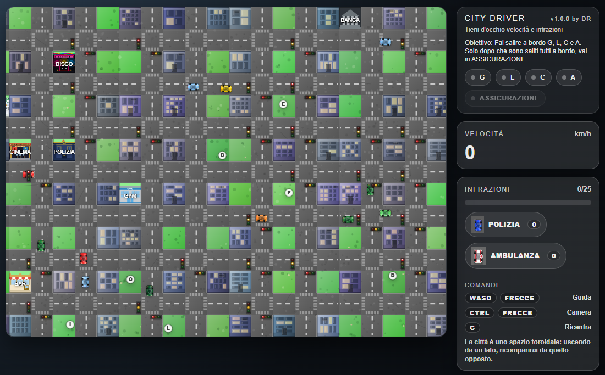

# City Driver v1.0.3

Un simulatore di guida 2D top-down con missioni, traffico AI e veicoli speciali. Creato con HTML, CSS e JavaScript Canvas.

## Descrizione

City Driver è un gioco in cui controlli un'auto in una città generata proceduralmente con traffico AI, semafori funzionanti e veicoli speciali. L'obiettivo è completare missioni trasportando passeggeri alle loro destinazioni, rispettando le regole della strada ed evitando collisioni.

**Demo Online:** Prova la versione live qui: [https://citydriver.darioros.it](https://citydriver.darioros.it)

## Come Giocare

1.  **Apri il file:** Apri il file `index.html` in un browser web moderno.
2.  **Controlli:**
    *   **Accelerare:** `W` o `Freccia Su`
    *   **Frenare/Retromarcia:** `S` o `Freccia Giù`
    *   **Sterzare a Sinistra:** `A` o `Freccia Sinistra`
    *   **Sterzare a Destra:** `D` o `Freccia Destra`
    *   **Centrare Camera:** `G` (scorrimento smooth per centrare l'auto)
3.  **Obiettivo:** Completa le missioni trasportando passeggeri alle loro destinazioni. Cerca di evitare incidenti con le altre auto e rispetta i semafori rossi. Le infrazioni vengono conteggiate. Il gioco termina se commetti troppe infrazioni o sbatti contro un palazzo.
4.  **Missioni:**
    *   All'avvio del gioco viene assegnato un obiettivo casuale.
    *   Raccogli i passeggeri (contrassegnati da lettere A-L sulle aree verdi).
    *   Portali alla destinazione indicata (edificio con insegna corrispondente).
    *   Al completamento della missione, vengono attivati effetti visivi di celebrazione.
5.  **Veicoli Speciali:**
    *   **Polizia:** Insegue i veicoli che commettono infrazioni.
    *   **Ambulanza:** Non rispetta i semafori, comportati con cautela.
6.  **Respawn:** Dopo un incidente, l'auto riparte vicino a strutture specifiche in base al tipo di incidente.

## Funzionalità Principali

*   **Mondo Generato Proceduralmente:** La mappa della città con strade, incroci ed edifici viene creata casualmente ad ogni avvio. Le aree verdi rappresentano l'erba e sono percorribili, mentre le aree grigie scure rappresentano gli edifici e fungono da ostacoli.
*   **Spazio Toroidale:** La città è uno spazio toroidale: uscendo da un lato, ricomparirai da quello opposto
*   **Traffico AI:** Auto controllate dal computer che guidano per la città, si fermano ai semafori e cercano di evitare collisioni.
*   **Veicoli Speciali:**
    *   **Auto della Polizia:** Non rispetta i semafori e insegue i veicoli che commettono infrazioni
    *   **Ambulanza:** Non rispetta i semafori
*   **Semafori Funzionanti:** Semafori agli incroci che cambiano stato (verde, giallo, rosso) a intervalli regolari.
*   **Feedback Visivo per Infrazioni:** Quando c'è un'infrazione di passaggio con il rosso, viene visualizzata una piccola luce flash accanto al semaforo
*   **Sistema di Missioni:** 
    *   All'avvio del gioco viene visualizzato un obiettivo a random
    *   Aggiunte 10 persone dislocate a random sulle aree verdi contrassegnate dalle lettere A-L
    *   L'obiettivo viene generato a random scegliendo da 2 a 4 passeggeri e una destinazione basata sulle insegne degli edifici
*   **Sistema di Respawn:** Dopo un incidente, l'auto riparte vicino a strutture specifiche:
    *   Incidente con ambulanza → Ospedale
    *   Incidente con polizia → Sede della Polizia
    *   Incidente con persona → Prigione
    *   Incidente con altra auto → Assicurazione
*   **Fisica Semplice:** Modello di guida basilare con accelerazione, frenata, attrito e sterzo.
*   **Sistema di Infrazioni:** Il gioco tiene traccia delle collisioni e del passaggio con il semaforo rosso.
*   **HUD:** Interfaccia utente che mostra la velocità attuale e il numero di infrazioni.
*   **Camera Dinamica:** 
    *   La visuale segue l'auto del giocatore con spostamento ottimizzato
    *   Premendo `G` si attiva uno scorrimento smooth della visuale per centrare l'auto
*   **Effetti Visivi:**
    *   All'avvio del gioco mostra un'onda attorno all'auto da guidare
    *   Miglioramento grafica edifici

## Tecnologie Utilizzate

*   HTML5
*   CSS3
*   JavaScript (con API Canvas 2D)

## Come Eseguire

Clona il repository o scarica i file, quindi apri il file `index.html` direttamente nel tuo browser web. Non sono necessarie dipendenze esterne o build steps.